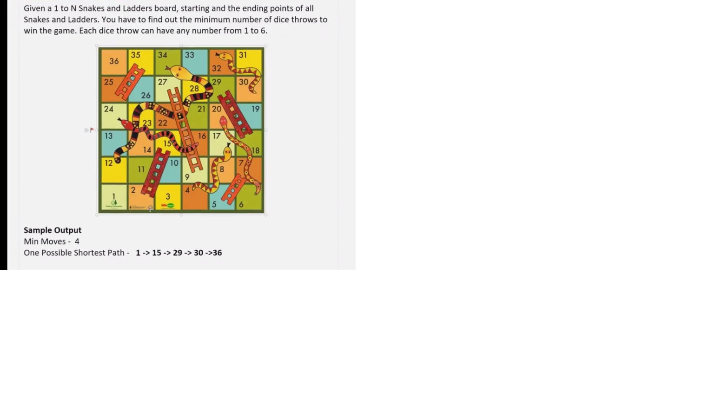

# Graph Implementation :smiley:

```c
#include<bits/stdc++.h>
using namespace std;

class Graph{
	
	int V;
	list<int>*l;
public:
	Graph(int v){
		V=v;
		//array of linked list
		l = new list<int>[V];
	}
	
	void addEdge(int u,int v,bool bidir=true){
		l[u].push_back(v);
		if(bidir){
			l[v].push_back(u);
		}
	}
	
	void printAdjList(){
		for(int i=0;i<V;i++){
			//l[i] is linked list
			cout<<i<<"->";
			for(int vertex:l[i]){
				cout<<vertex<<" , ";
			}
			cout<<endl;
		}
	}
};


int main()
{
	
	Graph g(5);
	g.addEdge(0,1);
	g.addEdge(0,4);
	g.addEdge(1,4);
	g.addEdge(1,3);
	g.addEdge(1,2);
	g.addEdge(4,3);
	g.addEdge(3,2);
	g.printAdjList();

	return 0;
}

```

---

# Generic Graph Implementation

```c
#include<bits/stdc++.h>
using namespace std;

template<typename T>

class Graph{
	
	map<T,list<T>>adjList;
public:
	
	 Graph(){
		
	}
	void addEdge(T u, T v, bool bidir=true){
		adjList[u].push_back(v);
		if(bidir){
			adjList[v].push_back(u);
		}
	}
	
	void printGraph(){
		//iterate over map
		for(auto i : adjList){
			//i.first is the key
			cout<<i.first<<"->";
			//i second is name of person i follows
			for(auto entry:i.second){
				cout<<entry<<" ,";
			}
			cout<<endl;
		}
	}
	
	
	
};


int main()
{
	Graph<string> g;
	g.addEdge("putin", "Trump", false);
	g.addEdge("putin", "modi", false);
	g.addEdge("putin", "pope", false);
	g.addEdge("trump", "modi", true);
	g.addEdge("modi", "yogi", true);
	g.addEdge("prabhu", "modi", false);
	g.printGraph();
	
	
	
	Graph<int>g2;
	g2.addEdge(0,1,true);
	g2.addEdge(1,2,false);
	g2.addEdge(0,2,true);
	g2.addEdge(1,3,true);
	g2.addEdge(1,4,true);
	g2.printGraph();
	
	
	return 0;
}


```

---

# Graph BFS Implementation

```c
#include<bits/stdc++.h>
using namespace std;

template<typename T>

class Graph{
	
	map<T,list<T>>adjList;
public:
	
	 Graph(){
		
	}
	void addEdge(T u, T v, bool bidir=true){
		adjList[u].push_back(v);
		if(bidir){
			adjList[v].push_back(u);
		}
	}
	
	void printGraph(){
		//iterate over map
		for(auto i : adjList){
			//i.first is the key 
			cout<<i.first<<"->";
			//i second is name of person i follows
			for(auto entry:i.second){
				cout<<entry<<" ,";
			}
			cout<<endl;
		}
	}
	
	void bfs(T src){
		queue<T>q;
		map<T,bool>visited;
		q.push(src);
		visited[src]=true;
		
		while(!q.empty()){
			T node = q.front();
			cout<<node<<" ";
			q.pop();
			
			//which are not visited neighbours of current node
			for(T neighbour:adjList[node]){
				if(!visited[neighbour]){
					q.push(neighbour);
					visited[neighbour]=true;
				}
				
			}
		}
		
	}
	
	
	//finding the single source shortest path using bfs traversal
	void distance(T src, T dest){
		queue<T>q;
		
		map<T,int>dist;
		
		map<T,T>parent;
		
		
		for(auto i:adjList){
			dist[i.first]=INT_MAX;
		}
		
		
		q.push(src);
		dist[src]=0;
		parent[src]=src;
		
		while(!q.empty()){
			T node = q.front();
			cout<<node<<" "; //you can print nodes level order wise as well
			q.pop();
			
			//which are not visited neighbours of current node
			for(T neighbour:adjList[node]){
				if(dist[neighbour]==INT_MAX){
					q.push(neighbour);
					dist[neighbour]=dist[node]+1;
					parent[neighbour]=node;
				}
				
			}
		}
		
		//printing the distance
		for(auto i:adjList){
			T node = i.first;
			cout<<"Dist of this "<<node<<" from "<<src<<" is "<<dist[node]<<endl;
			
		}
		
		// incase you want to see the path as well then parent map will come in working
		 T node = dest;
		 while(src!=node){
		 	cout<<node<<" parent is "<<parent[node]<<"  ";
		 	node = parent[node];
		 }
		
	}
	
	
	
};


int main()
{

	Graph<int>g;
	g.addEdge(0,1);
	g.addEdge(1,2);
	g.addEdge(0,4);
	g.addEdge(2,4);
	g.addEdge(2,3);
	g.addEdge(3,5);
	g.addEdge(3,4);
	
//	g.bfs(0);
	g.distance(0,5);
	
	return 0;
}


```

# Graph DFS Implementation

```c
#include<bits/stdc++.h>
using namespace std;

template<typename T>

class Graph{
	
	map<T,list<T>>adjList;
public:
	
	 Graph(){
		
	}
	void addEdge(T u, T v, bool bidir=true){
		adjList[u].push_back(v);
		if(bidir){
			adjList[v].push_back(u);
		}
	}
	
	void printGraph(){
		//iterate over map
		for(auto i : adjList){
			//i.first is the key
			cout<<i.first<<"->";
			//i second is name of person i follows
			for(auto entry:i.second){
				cout<<entry<<" ,";
			}
			cout<<endl;
		}
	}
	
	void dfsHelper(T node, map<T,bool> &visited){
		//whenever come to a node make it visited
		visited[node]=true;
		cout<<node<<" ";
		
		//try to find out the neighbour and not visited yet
		
		for(T neighbour:adjList[node]){
			if(!visited[neighbour]){
				dfsHelper(neighbour,visited);
			}
		}
		
	}
	
	
	void dfs(T src){
		map<T,bool>visited;
		
		dfsHelper(src,visited);
	}
	
	
	
};


int main()
{
	
	
	
	Graph<int>g;
	g.addEdge(0,1);
	g.addEdge(1,2);
	g.addEdge(0,4);
	g.addEdge(2,4);
	g.addEdge(2,3);
	g.addEdge(3,5);
	g.addEdge(3,4);
	
	g.dfs(0);
	
	
	return 0;
}


```

---

# Graph Snake and Ladder Problem 



```c
#include<bits/stdc++.h>
using namespace std;

template<typename T>

class Graph{
	
	map<T,list<T>>adjList;
public:
	
	 Graph(){
		
	}
	void addEdge(T u, T v, bool bidir=true){
		adjList[u].push_back(v);
		if(bidir){
			adjList[v].push_back(u);
		}
	}
	
	void printGraph(){
		//iterate over map
		for(auto i : adjList){
			//i.first is the key
			cout<<i.first<<"->";
			//i second is name of person i follows
			for(auto entry:i.second){
				cout<<entry<<" ,";
			}
			cout<<endl;
		}
	}
	
	int bfs(T src, T dest){
		queue<T>q;
		
		map<T,int>dist;
		
		map<T,T>parent;
		
		
		for(auto i:adjList){
			dist[i.first]=INT_MAX;
		}
		
		
		q.push(src);
		dist[src]=0;
		parent[src]=src;
		
		while(!q.empty()){
			T node = q.front();
			q.pop();
			
			//which are not visited neighbours of current node
			for(T neighbour:adjList[node]){
				if(dist[neighbour]==INT_MAX){
					q.push(neighbour); 
					dist[neighbour]=dist[node]+1;
					parent[neighbour]=node;
				}
				
			}
		}
		

		//you have destination and go backwards
		T temp = dest;
		while(src!=temp){
			cout<<temp<<" <-- ";
			temp=parent[temp];
		}
		cout<<src<<endl;
		return dist[dest];
		
	}
};

// in this just construct the graph all code is same like bfs used in traversal and single soure shortest path(SSSP)
int main()
{
	Graph<int>g;
	
	int board[50]={0};
	board[2]=13;
	board[5]=2;
	board[9]=18;
	board[18]=11;
	board[17]=-13;
	board[20]=-14;
	board[24]=-8;
	board[25]=-10;
	board[32]=-2;
	board[34]=-22;
	
	// construct the graph, add pair (u,v)
	
	
	for(int u=0;u<=36;u++){
		//at every node we can through a dice
		
		for(int dice=1;dice<=6;dice++){
			int v = u+dice+board[u+dice];
			
			g.addEdge(u,v,false);
		}
	}
	
	
	
	cout<<g.bfs(0,36);
	
	return 0;
}


```

# Graph Connected Components Finding via DFS

```c
#include<bits/stdc++.h>
using namespace std;

template<typename T>

class Graph{
	
	map<T,list<T>>adjList;
public:
	
	 Graph(){
		
	}
	void addEdge(T u, T v, bool bidir=true){
		adjList[u].push_back(v);
		if(bidir){
			adjList[v].push_back(u);
		}
	}
	
	void printGraph(){
		//iterate over map
		for(auto i : adjList){
			//i.first is the key
			cout<<i.first<<"->";
			//i second is name of person i follows
			for(auto entry:i.second){
				cout<<entry<<" ,";
			}
			cout<<endl;
		}
	}
	
	void dfsHelper(T node, map<T,bool> &visited){
		//whenever come to a node make it visited
		visited[node]=true;
		cout<<node<<" ";
		
		
		
		//try to find out the neighbour and not visited yet
		
		for(T neighbour:adjList[node]){
			if(!visited[neighbour]){
				dfsHelper(neighbour,visited);
			}
		}
		
	}
	
	
	void dfs(T src){
		map<T,bool>visited;
		
		int component = 1;
		
		dfsHelper(src,visited);
		
		cout<<endl;
		for(auto i:adjList){
			T city = i.first;
			if(!visited[city]){
				//called dfsHelper again for those which are not visited by source 
				dfsHelper(city,visited);
				component++;
			}
		}
		cout<<endl;
		cout<<"The number of components in this graph "<<component<<" ";
	}
	
	
	
};


int main()
{
	
	
	
	Graph<string>g;
	g.addEdge("Amritsar","Jaipur");
	g.addEdge("Amritsar","Delhi");
	g.addEdge("Delhi","Jaipur");
	g.addEdge("Mumbai","Jaipur");
	g.addEdge("Mumbai","Bhopal");
	g.addEdge("Delhi","Bhopal");
	g.addEdge("Mumbai","Bangalore");
	g.addEdge("Agra","Delhi");
	g.addEdge("Andman","Nicobar");
	

	g.dfs("Amritsar");
	
	
	return 0;
}
```

---

# Graph Topological Sort using DFS

### Topological sort is simple algorithm that outputs the linear ordering of vertices of the graph such that for every edge u to v u comes before v. It is useful when we want to create a Dependency graph. Works only on Directed Acyclic Graphs.

```c
#include<bits/stdc++.h>
using namespace std;

template<typename T>

class Graph{
	
	map<T,list<T>>adjList;
public:
	
	 Graph(){
		
	}
	void addEdge(T u, T v, bool bidir=true){
		adjList[u].push_back(v);
		if(bidir){
			adjList[v].push_back(u);
		}
	}
	
	void printGraph(){
		//iterate over map
		for(auto i : adjList){
			//i.first is the key
			cout<<i.first<<"->";
			//i second is name of person i follows
			for(auto entry:i.second){
				cout<<entry<<" ,";
			}
			cout<<endl;
		}
	}
	
	void dfsHelper(T node, map<T,bool> &visited, list<T> &ordering){
		
		visited[node]=true;
		
		//will call dfs on unvisited neighbours 
		for(T neighbour:adjList[node]){
			if(!visited[neighbour]){
				dfsHelper(neighbour,visited,ordering);
			}
		}
		
		//at this point all the childern of current node have been visited;
		ordering.push_front(node);
	}
	
	void dfsTopologicalSort(){
		map<T,bool>visited;
		list<T>ordering;
		
		
		for(auto i:adjList){
			// i is pair followed by its neighbour node adjList 
			T node = i.first;
			
			if(!visited[node]){
				dfsHelper(node,visited,ordering);
			}
		}
		
		//print all elements in ordering 
		for(T element:ordering){
			cout<<element<<"-->";
		}
	}
};


int main()
{
	Graph<string>g;
	g.addEdge("English","Programming Logic",false);
	g.addEdge("Maths","Programming Logic",false);
	g.addEdge("Programming Logic","HTML",false);
	g.addEdge("Programming Logic","Python",false);
	g.addEdge("Programming Logic","Java",false);
	g.addEdge("Programming Logic","JS",false);
	g.addEdge("Python","Web Dev",false);
	g.addEdge("HTML","CSS",false);
	g.addEdge("CSS","JS",false);
	g.addEdge("JS","Web Dev",false);
	g.addEdge("Java","Web Dev",false);
	
	//g.printGraph(); incase requirement of printing the graph
	
	g.dfsTopologicalSort();
	
	return 0;
}

```
---

# Graph Topological Sort using BFS :heart_eyes:
<p>The idea behind the bfs topological sort is to resolve those nodes or vertices first whose indegree is zero and process it
 whenever we processes it out from queue we keep reducing the indegrees of its neighbour , if any point of time neighbours indegree meet the 
requirement (means zero) we push it into the queue as well.</p>

```c
#include<bits/stdc++.h>
using namespace std;

template<typename T>

class Graph{
	
	map<T,list<T>>adjList;
public:
	
	 Graph(){
		
	}
	void addEdge(T u, T v, bool bidir=true){
		adjList[u].push_back(v);
		if(bidir){
			adjList[v].push_back(u);
		}
	}
	
	void printGraph(){
		//iterate over map
		for(auto i : adjList){
			//i.first is the key
			cout<<i.first<<"->";
			//i second is name of person i follows
			for(auto entry:i.second){
				cout<<entry<<" ,";
			}
			cout<<endl;
		}
	}
	
	void bfsTopologicalSort(){
		queue<T>q;
		map<T,bool>visited;
		map<T,int>indegree;
		
		for(auto i:adjList){
			T node = i.first;
			visited[node]=false;
			indegree[node]=0;
		}
		
		//increment the indegree of neighbours of node 
		
		for(auto i:adjList){
		
			for(T neighbour:adjList[i.first]){
				indegree[neighbour]++;
			}
		}
		
		
		//push all the nodes in queue whose indegree is zero initially
		for(auto i:adjList){
			T node = i.first;
			if(indegree[node]==0){
				q.push(node);
			}
		}
		
		
		//start with algorithm
		while(!q.empty()){
			T node =q.front();
			q.pop();
			cout<<node<<" ";
			
			for(T neighbour:adjList[node]){
				indegree[neighbour]--; 
				//if any point the indegree of neighbour become zero push it in the queue
				if(indegree[neighbour]==0){
					q.push(neighbour);
				}
			}
		} 
		
		
	}
	
	
	
};


int main()
{
	
	
	// the idea is to resolve those nodes first whose indegree is zero 
	
	Graph<int>g;
	g.addEdge(0,2,false);
	g.addEdge(1,2,false);
	g.addEdge(2,3,false);
	g.addEdge(2,4,false);
	g.addEdge(4,5,false);
	g.addEdge(3,5,false);
	g.printGraph();
	g.bfsTopologicalSort();
	
	
	Graph<string>g2;
	g2.addEdge("English","Programming Logic",false);
	g2.addEdge("Maths","Programming Logic",false);
	g2.addEdge("Programming Logic","HTML",false);
	g2.addEdge("Programming Logic","Python",false);
	g2.addEdge("Programming Logic","Java",false);
	g2.addEdge("Programming Logic","JS",false);
	g2.addEdge("Python","Web Dev",false);
	g2.addEdge("HTML","CSS",false);
	g2.addEdge("CSS","JS",false);
	g2.addEdge("JS","Web Dev",false);
	g2.addEdge("Java","Web Dev",false);
	g2.bfsTopologicalSort();
	
	
	return 0;
}


```

---

# Cycle Detection For Undirected Graph BFS

```c
#include<bits/stdc++.h>
using namespace std;

template<typename T>

class Graph{
	
	map<T,list<T>>adjList;
public:
	
	 Graph(){
		
	}
	void addEdge(T u, T v, bool bidir=true){
		adjList[u].push_back(v);
		if(bidir){
			adjList[v].push_back(u);
		}
	}
	
	void printGraph(){
		//iterate over map
		for(auto i : adjList){
			//i.first is the key
			cout<<i.first<<"->";
			//i second is name of person i follows
			for(auto entry:i.second){
				cout<<entry<<" ,";
			}
			cout<<endl;
		}
	}
	
	//check for undirected graph
	bool isCyclicBFS(T src){
		
		map<T,bool>visited;
		map<T,T>parent;
		queue<T>q;
		q.push(src);
		visited[src]=true;
		parent[src]=src;
		
		while(!q.empty()){
			T node = q.front();
			q.pop();
			
			//iterate overs the neighbour of node
			
			for(T neighbour:adjList[node]){
				// the conditon  is used to check whether the negihbour is already visited or not 
				// and also check whether the parent of current node is not the neighbour 
				//because the parent of node is neighbour same as parent it will return true in that case also, we put the negative conditon
				//as every time we had already visited the parent and parent is also its neighbour it is basically exception
				if(visited[neighbour]==true and parent[node]!=neighbour){ 
					return true;	
				}
				
				else if(!visited[neighbour]){
					visited[neighbour]=true;
					parent[neighbour]=node;
					q.push(neighbour);
				}
			}
		}
		return false;
	}
	
	
	
};


int main()
{

	
	
	Graph<int>g;
	g.addEdge(0,1);
	g.addEdge(1,4);
	g.addEdge(2,3);
	g.addEdge(4,3);
	
	
	if(g.isCyclicBFS(1)){
		cout<<"Cyclic Graph";
	}else{
		cout<<"Not cyclic graph";
	}
	
	
	
	return 0;
}

```

# Cycle Detection in Directed Graph DFS

```c
//cycle detection directed graph
#include<bits/stdc++.h>
using namespace std;

template<typename T>

class Graph{
	
	map<T,list<T>>adjList;
public:
	
	 Graph(){
		
	}
	void addEdge(T u, T v, bool bidir=true){
		adjList[u].push_back(v);
		if(bidir){
			adjList[v].push_back(u);
		}
	}
	
	void printGraph(){
		//iterate over map
		for(auto i : adjList){
			//i.first is the key
			cout<<i.first<<"->";
			//i second is name of person i follows
			for(auto entry:i.second){
				cout<<entry<<" ,";
			}
			cout<<endl;
		}
	}
	
	bool isCyclicHelper(T node, map<T,bool> &visited, map<T,bool> &inStack){
		
		//processing the current node 
		
		visited[node]=true;
		inStack[node]=true;
		
		//explore the neighbours of the node
		for(T neighbour:adjList[node]){
			//the current node is not visited but its further branch is leanding to cycle
			if((!visited[neighbour] && isCyclicHelper(neighbour,visited,inStack))||inStack[neighbour]){
				return true;
			}
		}
		
		inStack[node]=false;
		return false;
	}
	
	bool isCyclic(){
		
		map<T,bool>visited;
		map<T,bool>inStack;
		
		for(auto i:adjList){
			T node =i.first;
			if(!visited[node]){
				bool cyclePresent = isCyclicHelper(node,visited,inStack);
				if(cyclePresent){
					return true;
				}
			}
		}
		
		return false;
	}
	
	
	
};


int main()
{
	
	
	Graph<int>g;
	g.addEdge(0,2,false);
	g.addEdge(0,1,false);
	g.addEdge(2,3,false);
	g.addEdge(2,4,false);
	g.addEdge(3,0,false);
	g.addEdge(4,5,false);
	g.addEdge(1,5,false);
	
	cout<<g.isCyclic();
	return 0;
}


```

---

# DijKstra Algorithm

```c
#include<bits/stdc++.h>
using namespace std;

template<typename T>

class Graph{
	
	unordered_map<T,list<pair<T,int>>>adjList;
public:
	void addEdge(T u, T v, int dist, bool bidir=true){
		
		adjList[u].push_back(make_pair(v,dist));
		if(bidir){
			adjList[v].push_back(make_pair(u,dist));
		}
	}
	
	void printAdj(){
		//iterate over all key value pairs
		for(auto i:adjList){
			//i.first is the key or node
			cout<<i.first<<" ";
			//i.second is the list of neighbours
			for(auto l:i.second){
				//inside list there is pair where l.first is neighbour node and l.second is weight or we can say distance
				cout<<"("<<l.first<<" "<<l.second<<") ";
			}
			cout<<endl;
		}
	}
	
	void dijkstraSSSP(T src){
		
		
		unordered_map<T,int>dist;
		
		//set all distances to infinity
		for(auto j:adjList){
			dist[j.first]=INT_MAX;
		}
		
		//make a set to find out a node with minium distacne;
		set<pair<int,T>>s;
		dist[src]=0;
		
		s.insert(make_pair(0,src));
		
		while(!s.empty()){
			
			//find the pair at the front
			
			auto p = *(s.begin());
			T node = p.second; //second parameter denotes the node
			int nodeDist = p.first;//first parameter denotes the dist
			
			s.erase(s.begin());
			
			//iterate over the neighbours
			for(auto childPair:adjList[node]){
				if(nodeDist+childPair.second<dist[childPair.first]){
					
					T dest = childPair.first;
					auto f = s.find(make_pair(dist[dest],dest));
					if(f!=s.end()){
						s.erase(f);
						
					}
					//insert the new pair
					dist[dest]=nodeDist+childPair.second;
					s.insert(make_pair(dist[dest],dest));
				}
			}
			
		}
		
		//print dist to all other nodes
		
		for(auto d:dist){
			cout<<d.first<<" is located at distance of "<<d.second<<endl;
		}
		
	}
};


int main(){
	
	Graph<int>g;
	
	g.addEdge(1,2,1);
	g.addEdge(1,3,4);
	g.addEdge(1,4,7);
	g.addEdge(2,3,1);
	g.addEdge(3,4,2);
	
	g.printAdj();
	g.dijkstraSSSP(1);
	
	
	
	Graph<string>india;
	india.addEdge("Amritsar","Delhi",1);
	india.addEdge("Amritsar","Jaipur",4);
	india.addEdge("Jaipur","Delhi",2);
	india.addEdge("Jaipur","Mumbai",8);
	india.addEdge("Bhopal","Agra",2);
	india.addEdge("Mumbai","Bhopal",3);
	india.addEdge("Agra","Delhi",1);
	
	india.printAdj();
	india.dijkstraSSSP("Amritsar");
	
	
	return 0;
}

```

